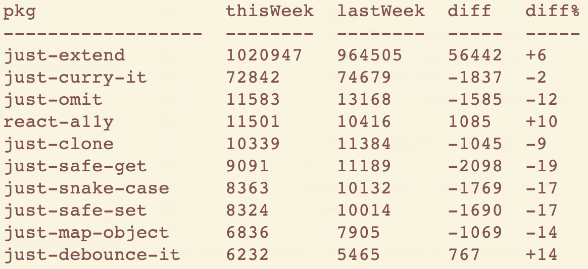

# My Downloads

List download totals and trends for npm packages based on author or keyword.\
Use as a CLI or an in-program API

## CLI



### args

- `searchMask`

values: see https://github.com/npm/registry/blob/master/docs/REGISTRY-API.md \
e.g. `author:<name>`, `maintainer:<name>`, `keywords:<keyword>`, `<generic search term>`\

- **--sort** `sort order (optional)`

values: `thisWeek` (default), `lastWeek`, `diff` (absolute difference versus last week), `diff%` (percent difference versus last week)

- **--direction** `sort direction (optional)`

values: `down` (default), `up`

### Globally

#### installation

`yarn global add my-downloads` or\
`npm i -g my-downloads`

#### usage examples

`downloads author:jed`\
(list downloads for packages authored by @jed, default sort is by this week's downloads)

`downloads author:jed --sort 'diff%'`\
(sorts by percent change since last week)\

`downloads author:jed --sort 'diff%' --direction 'up'`\
(sorts by percent change since last week, ascending)\

`downloads maintainer:angus-c`\
(list downloads for packages maintained by @angus-c)

`downloads keywords:bundler`\
(list downloads for packages with the "bundler" keyword)

`downloads pie`\
(list downloads related to pie)

### Locally

#### installation

`yarn add my-downloads` or\
`npm i my-downloads`

#### usage example

`yarn downloads author:jed` or\
`npm downloads author:jed`

etc.\

## API

import downloads from 'my-downloads'

```js
downloads('author:jed', 'diff%', 'up').then({totals, details} => /* your code here */);
```

### return values

`totals`: the totals for all listed packages\
object with properties `pkg` (string), `thisWeek` (number), `lastWeek` (number), `diff` (number), `diff%` (number).

`details`: the details for all listed packages\
array of objects with properties `pkg` (string), `thisWeek` (number), `lastWeek` (number), `diff` (number), `diff%` (number).

## Known Issues

* **Hyphenated author names:** The npm registry API doesn't currently process hyphenated author names, so if you're searching for an author with a hyphenated name you'll need to use `maintainer:` instead.
* **Scoped packages:** The npm registry cannot currently provide download data for scoped packages. Consequently I'm filtering scoped packages from search results.

